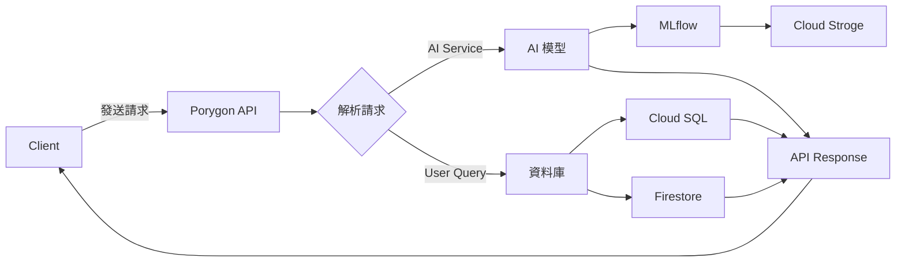

# Porygon API 架構詳解
## Architecture

Porygon API 是一個基於 FastAPI 的服務，提供 AI 模型預測和資料庫查詢功能。


## API Endpoint
1. Document UI: https://porygon-api-931091704211.asia-east1.run.app/docs

## Code Architecture

程式碼架構採用分層設計：
```bash
porygon_api
├── app
│   ├── AIservice
│   │   ├── dependencies.py
│   │   ├── router.py
│   │   ├── schemas.py
│   │   ├── service.py
│   │   └── v1
│   │       ├── __init__.py
│   │       └── wikipedia_agent.py
│   ├── UserQuery
│   │   ├── dependencies.py
│   │   ├── router.py
│   │   ├── schemas.py
│   │   ├── service.py
│   │   └── v1
│   │       ├── Item.py
│   │       ├── __init__.py
│   ├── __init__.py
├── database
│   ├── __init__.py
│   └── db_connector.py
├── main.py
├── middleware
│   ├── auth.py
│   ├── http.py
│   └── logging.py
├── model_manager.py
├── schemas.py
├── security
│   └── api_key.py -> 用於管理 用戶端的 API key & 角色權限控管
├──deploy.sh -> 部署腳本
├──Dockerfile
├──entry-point.sh -> 啟動 container 初始化腳本
├──Makefile 
├──requirement.txt
├──get_secret.py -> 透過該腳本取得 Google Secret manager 中的所有帳號密碼資訊
```

## main

## model manager
`porygon_api/model_manager.py`
### 主要職責

- 加載和管理 AI 模型
- 提供模型推理功能
- 處理模型輸入和輸出格式

### 範例

```python
class ModelManager:
    _instance = None
    _lock = threading.Lock()
    
    def _preload_model(self):
        # 預加載模型
        self.model = mlflow.pyfunc.load_model(self.model_uri)
    
    def predict(self, data):
        # 使用模型進行預測
        result = model.predict(data)
```

模型管控透過 MLflow ，用來作 模型 的 加載、版本管理和監控。

## 中間件層 (Middleware Layer)
處理認證、日誌和請求追蹤
`porygon_api/middleware/`

### 主要職責

- 處理 請求前/後的通用邏輯
- 實現認證和授權功能 (Auth)
- 記錄請求日誌和監控指標

### 範例

```python
# auth.py
class AuthMiddleware(BaseHTTPMiddleware):
    async def dispatch(self, request: Request, call_next):
        # 驗證 API Key

# http.py
class HttpMiddleware(BaseHTTPMiddleware):
    async def dispatch(self, request: Request, call_next):
        # 記錄請求處理時間和結果
```

中間件提供跨越多個請求的通用功能，如認證、性能監控等。

## 路由層 (Router Layer)
處理 HTTP 請求路由和參數解析
`porygon_api/app/AIservice/router.py`
`porygon_api/app/UserQuery/router.py`

### 主要職責

- 定義 API Endpoint 和 Router
- 處理 HTTP Request 和 Respones
- 向 Client 端提供 接口

### 範例

```python
# AIservice/router.py
router = APIRouter()
router.include_router(router=wikipedia_agent.router, prefix="/wikipedia_agent")

# UserQuery/router.py
router = APIRouter()
router.include_router(router=Item.router, prefix="/resource")
```

服務分為兩大功能模塊：
- **AIservice**: 提供基於 MLflow 中的Model作預測作推理
- **UserQuery**: 提供資料庫項目查詢功能

## 服務層 (Service Layer)
`porygon_api/app/AIservice/service.py`
`porygon_api/app/UserQuery/service.py`

### 職責

- 實現 主要的業務邏輯
- 處理數據轉換和錯誤處理
- 與資料庫交互

### 範例

```python
# AIservice/service.py
class AIService:
    _instance = None  # 單例模式

    async def predict(self, request: QueryRequest) -> List[PredictResponse]:
        # 使用模型進行預測

# UserQuery/service.py
class ItemService:
    _instance = None

    async def get_item(self, item_id: str) -> Optional[Dict[str, Any]]:
        # 從 Cloud SQL 查詢 Item

    async def get_product(self, collection: str, product_id: str) -> Dict[str, Any]:
        # 從 Firestore 查詢 Product
```

服務層採用單例模式，確保系統資源高效利用。

## 結構層 (Schema Layer)

`porygon_api/app/AIservice/schemas.py`
`porygon_api/app/UserQuery/schemas.py`

### 職責

- 定義請求和響應的數據結構
- 實現數據驗證邏輯
- 提供數據序列化和反序列化功能

### 範例

```python
# AIservice/schemas.py
class QueryRequest(BaseModel):
    query: str

class PredictResponse(BaseModel):
    answers: str

# UserQuery/schemas.py
class ItemBase(BaseModel):
    name: str = Field(..., description="物品名稱")
    description: Optional[str] = Field(None, description="物品描述")
```

## 資料庫層 (Database Layer)
與 Cloud SQL 和 Firestore 交互
`porygon_api/database/db_connector.py`

### 主要職責

- 提供 API & DB 的操作對接
- 處理 DB Transaction 和 Connection

### 範例

```python
class CloudSQLConnector:
    _instance = None

    def connect(self):
        # 連接到 Cloud SQL

    def execute_query(self, query, params=None):
        # 執行 SQL 查詢

class FirestoreConnector:
    _instance = None

    def connect(self):
        # 連接到 Firestore
```

支持兩種數據庫：
- **Cloud SQL**: 用於關係式數據存儲
- **Firestore**: 用於 NoSQL 文檔存儲

## 監控與日誌層 (Monitoring & Logging)

### 主要職責

- 記錄系統日誌
- 監控系統性能
- 提供可視化分析數據

### 結構化日誌格式

所有日誌使用 JSON 格式輸出，包含以下字段：
- **timestamp**: 日誌時間
- **level**: 日誌級別
- **module**: 模塊名稱
- **line**: 代碼行號
- **message**: 日誌信息

### Cloud Logging 整合

應用自動將日誌發送到 Google Cloud Logging，無需額外配置。當部署到 Cloud Run 時，標準輸出會被自動收集。

### BigQuery 整合

設置 Log Sink 將日誌從 Cloud Logging 導出到 BigQuery，實現以下功能：
- 長期日誌存儲
- 複雜查詢分析
- 性能監控和異常檢測

### 示例查詢

```sql
SELECT
  JSON_EXTRACT_SCALAR(jsonPayload, '$.path') AS endpoint,
  COUNT(*) AS request_count,
  AVG(CAST(JSON_EXTRACT_SCALAR(jsonPayload, '$.process_time') AS FLOAT64)) AS avg_time
FROM
  `project_id.dataset.table`
WHERE
  timestamp >= TIMESTAMP_SUB(CURRENT_TIMESTAMP(), INTERVAL 1 DAY)
GROUP BY
  endpoint
ORDER BY
  avg_time DESC;
```

## Deplyment

### 本地測試

使用以下command在本地運行該 API Service

```bash
gunicorn porygon_api.main:app \
  -k uvicorn.workers.UvicornWorker \
  --preload \
  --workers 4 \
  --bind 0.0.0.0:8080 \
  --timeout 120 \
  --keep-alive 120
```

### Deploy on Google Cloud Run

1. **構建 Docker 鏡像**：
   ```bash
   make build-m1 && make tag && make push
   ```

2. **部署到 Cloud Run**：
   ```
   sh deploy.sh
   ```

3. **環境變數設置**：
   - `GCP_PROJECT_ID`: GCP Project ID
   - `MODEL_URI`: MLflow Model URI
   - `MLFLOW_TRACKING_URI`: MLflow Tracking Server URI

## 關鍵設計模式

1. **單例模式**: 確保服務和連接器只被實例化一次
2. **依賴注入**: 通過 FastAPI 的依賴系統提供服務實例
3. **Middleware**: 通過中間件鏈處理請求的通用邏輯
4. **Preload 策略**: 在服務啟動時預加載模型，提高性能
5. **日誌集中化**: 將所有日誌集中到 Cloud Logging 和 BigQuery

## 安全性

- **API 密鑰認證**: 使用 X-API-Key head 進行認證
- **基於角色的訪問控制**: 不同角色擁有不同的端點訪問權限
- **請求 ID 追蹤**: 每個請求分配唯一 ID 用於跟踪和審計

## 日誌與監控最佳實踐

1. **結構化日誌**: 使用 JSON 格式確保日誌可以被有效解析和查詢
2. **包含上下文**: 在日誌中包含request ID、Client ID ..etc
3. **性能指標**: 記錄請求處理時間等性能指標
4. **集中分析**: 將 Log 導出到 BigQuery 進行分析
5. **設置警報**: 基於日誌數據設置異常Alert

## HTTP Status Code

### Success
- **200 OK**: Request 成功處理，結果在 Respones 中返回

### Client Error
- **400 Bad Request**: 請求參數無效或缺失
- **401 Unauthorized**: 缺少認證信息或認證失敗
- **403 Forbidden**: 認證成功但沒有權限訪問請求的資源
- **404 Not Found**: 請求的資源不存在

### Server Error
- **500 Internal Server Error**: 服務器遇到意外情況
- **503 Service Unavailable**: 服務暫時不可用（如模型未加載）
- **504 Gateway Timeout**: 處理請求時超時

### Self-customized
除了 HTTP 狀態碼外，Porygon API 還在 Response 中提供 `responseCode` 字段：

- **200-299**: 成功處理
- **400-499**: 客戶端錯誤
- **500-599**: 服務器錯誤

`responseMessage` 會提供更多具體錯誤描述。


## 資料庫 Schema 設計

Porygon API 使用兩種資料庫系統：Cloud SQL (PostgreSQL) 用於關係型數據和 Firestore 用於文檔型數據。

### Cloud SQL Schema

#### Table: items 
```sql
CREATE TABLE items (
    id VARCHAR(50) PRIMARY KEY,
    name VARCHAR(255) NOT NULL,
    description TEXT,
    price DECIMAL(10, 2) NOT NULL,
    quantity INTEGER NOT NULL DEFAULT 0,
    category VARCHAR(100),
    created_at TIMESTAMP WITH TIME ZONE DEFAULT CURRENT_TIMESTAMP,
    updated_at TIMESTAMP WITH TIME ZONE DEFAULT CURRENT_TIMESTAMP
);
```
-- Index
CREATE INDEX idx_items_category ON items(category);
CREATE INDEX idx_items_name ON items(name);

### FireStore

#### Collection: Product
```json
{
  "Product_id": "string",  // 產品唯一標識符 (用於查詢)
  "name": "string",        // 產品名稱
  "description": "string", // 產品描述
  "price": "number",       // 產品價格
  "quantity": "number",    // 庫存數量
  "category": "string",    // 產品類別
  "properties": {          // 產品特性 (可選)
    "key1": "value1",
    "key2": "value2"
  },
  "tags": ["string"],      // 產品標籤 (可選)
  "created_at": "timestamp", // 創建時間
  "updated_at": "timestamp"  // 更新時間
}
```

## Tech Stack
- Google Cloud Platform
  - Google Cloud Run
    - 部署 API 
  - Cloud SQL: 
    - 存放使用者查詢的資料表
    - 紀錄 Mlflow 的 Log 表
  - Firestore
  - Cloud Logging
  - BigQuery
  - Container Registry: 存放 Image
- FastAPI
- MLflow
## TO-DO
### 擴展方案

1. **垂直擴展**：
   - 升級 CPU 和 Memory 以處理更多負載 (Cloud SQL , Cloud Run)
   - 建議：當 查詢複雜, 數據量變大, 請求量變大 時使用

2. **水平擴展**：
    - Google Kubernetes Engine: 高併發, 多個微服務的串接
  
3. **程式優化**:
    - CICD
    - 將 Cloud SQL & Firestore 邏輯分開
    - AI Model Preload
    - 高併發測試 (Ex: 透過 Mulit-thread 短時間內高併發測試 API 負載)